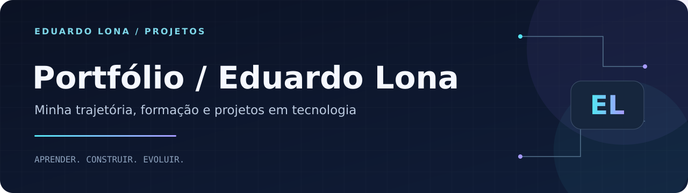

<p align="center"></p>

<p align="center"><strong>HTML · CSS · JavaScript · Design responsivo</strong></p>
<p align="center"><a href="#sobre">Sobre</a> · <a href="#como-executar">Como executar</a> · <a href="https://github.com/Dudulonabr">Perfil do autor</a></p>

# Portfólio — Eduardo Lona

## Sobre

Meu ponto de apresentação profissional: formação, experiência prática com tecnologia, competências e projetos reunidos em uma interface web. Sou estudante de **ADS e Engenharia de Software**, com formação técnica pelo **SENAC**, e estou desenvolvendo minha trajetória entre **software, web e suporte de TI**.

## Explore meus projetos

| Projeto | O que demonstra | Código |
| --- | --- | --- |
| Gestão de Chamados de TI | Python, regras de prioridade, JSON e indicadores | [PIM Microsoft](https://github.com/Dudulonabr/PIM-Microsoft) |
| Futuro das Cidades | Site com múltiplas páginas, gráficos e simulador | [Futuro das Cidades](https://github.com/Dudulonabr/Futuro-das-Cidades) |
| Currículo Web | Apresentação profissional e interação no navegador | [Currículo](https://github.com/Dudulonabr/Curriculo_Eduardo_Lona) |
| Laboratório de JavaScript | Dez exercícios de lógica de programação | [Exercícios](https://github.com/Dudulonabr/Atividade-java) |

## Recursos do portfólio

- Apresentação pessoal e trajetória na área de TI.
- Formação acadêmica e área de certificados.
- Seções de projetos, experiência e competências.
- Links de contato e arquivo de currículo em PDF.
- Animações, navegação por seções e interface responsiva.

O cartão de projeto full stack presente na página representa um projeto em planejamento.

## Como executar

```bash
git clone https://github.com/Dudulonabr/Portifolio.git
cd Portifolio
python -m http.server 8000
```

Abra **http://localhost:8000**. Você também pode abrir `index.html` diretamente no navegador ou usar o Live Server. Não há etapa de build obrigatória. Fontes externas podem depender de conexão à internet.

## Organização

| Caminho | Conteúdo |
| --- | --- |
| `index.html` | Conteúdo e estrutura da página |
| `css/style.css` | Identidade visual e responsividade |
| `js/main.js` | Interações e animações |
| `assets/` | Foto, imagens e currículo |
| `docs/` | Documentação e identidade visual dos repositórios |

## Tecnologias e aprendizados

**HTML, CSS e JavaScript**, com foco em apresentação de conteúdo, experiência de navegação, hierarquia visual, responsividade e interação com o DOM.

## Autor

**Eduardo Moreira Monteiro Lona** · São Paulo, Brasil

Estudante de **Análise e Desenvolvimento de Sistemas (UNIP)** e **Engenharia de Software (Cruzeiro do Sul)**, com formação técnica em **Informática pelo SENAC**.

[LinkedIn](https://www.linkedin.com/in/eduardo-moreira-monteiro-lona) · [E-mail](mailto:dudulona07@gmail.com) · [GitHub](https://github.com/Dudulonabr)
